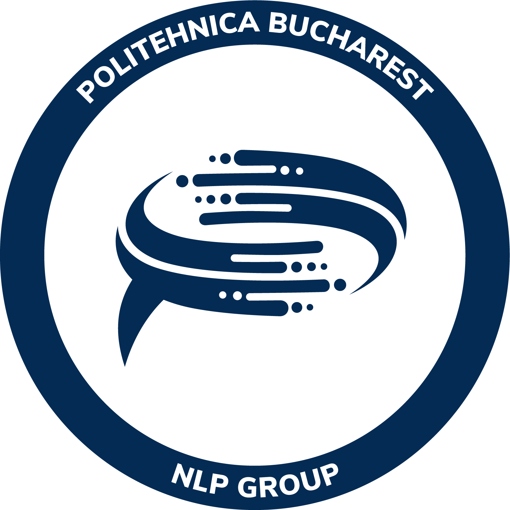

![Homework][homework-shield]

<!-- PROJECT LOGO -->
 

  

<h3 align="center">CrossRead</h3>

  

    CrossRead is a user-centered NLP platform designed to facilitate the comparison of news articles across multiple sources, addressing the lack of fact-checking tools specifically for Romanian news.
     
     
    <a href="https://github.com/miron-boiangiu/CrossRead/issues">Report Bug</a>
    ·
    <a href="https://github.com/miron-boiangiu/CrossRead/issues">Request Feature</a>
  

(<a href="#top">back to top</a>)

## File Structure

- Backend/ -> the Flask backend of the application.
- Frontend/ -> the React frontend of the application.

(<a href="#top">back to top</a>)

<!-- CONTACT -->
## Contact

Victor-Miron Boiangiu - miron.boiangiu@gmail.com

Stefan Ruseti - stefan.ruseti@upb.ro

Mihai Dascalu - mihai.dascalu@upb.ro

(<a href="#top">back to top</a>)

<!-- MARKDOWN LINKS & IMAGES -->
<!-- https://www.markdownguide.org/basic-syntax/#reference-style-links -->
[contributors-shield]: https://img.shields.io/github/contributors/miron-boiangiu/CrossRead.svg?style=for-the-badge
[contributors-url]:https://github.com/miron-boiangiu/CrossRead/graphs/contributors
[forks-shield]: https://img.shields.io/github/forks/miron-boiangiu/CrossRead.svg?style=for-the-badge
[forks-url]:https://github.com/miron-boiangiu/CrossRead/network/members
[stars-shield]: https://img.shields.io/github/stars/miron-boiangiu/CrossRead.svg?style=for-the-badge
[stars-url]:https://github.com/miron-boiangiu/CrossRead/stargazers
[homework-shield]: https://img.shields.io/badge/UPB-NLP_Group-%23deeb34?style=for-the-badge

